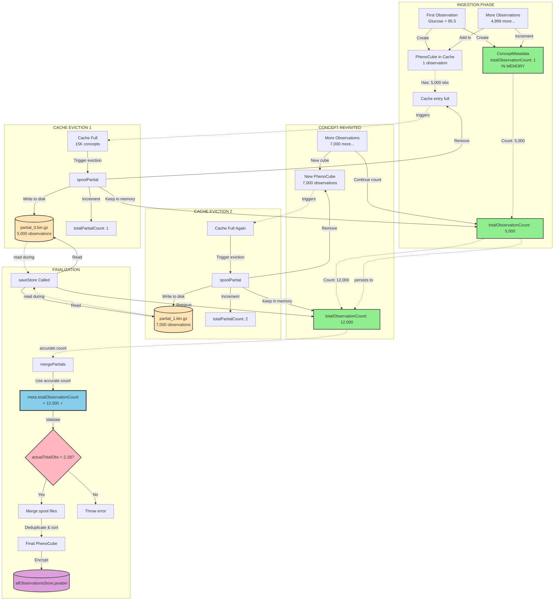

# SpoolingLoadingStore Workflow

Complete workflow showing how observations flow from ingestion through spooling to finalization, and how metadata is tracked throughout.

## Overview

The `SpoolingLoadingStore` uses a cache-based architecture that allows memory-bounded observation processing. When the cache fills up, concepts are "spooled" to disk, and the same concept can be spooled multiple times if it appears again in later batches.

**Key insight:** Metadata (including observation counts) stays in memory throughout the entire process, while observation data is written to/read from disk.

## Visual Summary (Mermaid Diagram)



**Legend:**
- 🟢 **Green boxes**: Metadata (stays in memory throughout)
- 🟡 **Yellow cylinders**: Spool files (disk storage)
- 🔵 **Blue box**: Observation count from metadata (used for validation)
- 🟣 **Purple cylinder**: Final encrypted output
- 🔴 **Pink diamond**: Validation check

## Detailed Step-by-Step Workflow

```
═══════════════════════════════════════════════════════════════════════════════
PHASE 1: INGESTION - Observations Added One at a Time
═══════════════════════════════════════════════════════════════════════════════

First Observation for Concept:
┌─────────────────────────────────────────────────────────────────────────────┐
│ addObservation(patientNum=101, conceptPath="/Study/LabTest/Glucose", ...)  │
│                                                                             │
│ ┌─────────────────────────────────────────────────────────────────────┐   │
│ │ Create ConceptMetadata (STAYS IN MEMORY FOREVER)                    │   │
│ │   - isCategorical: false (numeric)                                  │   │
│ │   - totalObservationCount: 0 → 1  ← INCREMENTED                    │   │
│ │   - observationCount: 0 → 1                                         │   │
│ │   - totalPartialCount: 0                                            │   │
│ └─────────────────────────────────────────────────────────────────────┘   │
│                                                                             │
│ ┌─────────────────────────────────────────────────────────────────────┐   │
│ │ Cache: Load or create PhenoCube                                     │   │
│ │   cube.add(patientNum=101, value=95.5, timestamp)                   │   │
│ └─────────────────────────────────────────────────────────────────────┘   │
└─────────────────────────────────────────────────────────────────────────────┘
        │
        │ Stored in:
        ├──→ conceptMetadata["/Study/LabTest/Glucose"] = meta (IN MEMORY)
        └──→ cache["/Study/LabTest/Glucose"] = cube (IN MEMORY, ~15K concepts max)


Subsequent Observations (Observations 2-5,000):
┌─────────────────────────────────────────────────────────────────────────────┐
│ addObservation() called 4,999 more times...                                 │
│                                                                             │
│ Each call:                                                                  │
│   1. meta.totalObservationCount.incrementAndGet()  ← ALWAYS INCREMENTS     │
│   2. meta.observationCount.incrementAndGet()                                │
│   3. cache.get(conceptPath).add(...)               ← Add to cube in cache  │
│                                                                             │
│ Result:                                                                     │
│   - meta.totalObservationCount: 1 → 2 → 3 → ... → 5,000                   │
│   - meta.observationCount: 1 → 2 → 3 → ... → 5,000                        │
│   - Cube in cache has 5,000 observations                                   │
└─────────────────────────────────────────────────────────────────────────────┘


═══════════════════════════════════════════════════════════════════════════════
PHASE 2: CACHE EVICTION - Spool File Created (First Time)
═══════════════════════════════════════════════════════════════════════════════

Cache Fills Up (15,000 concepts in memory):
┌─────────────────────────────────────────────────────────────────────────────┐
│ Cache evicts oldest concept: "/Study/LabTest/Glucose"                      │
│                                                                             │
│ RemovalListener triggered:                                                 │
│   spoolPartial(conceptPath, cube)                                          │
│                                                                             │
│   ┌─────────────────────────────────────────────────────────────────┐     │
│   │ WRITE TO DISK:                                                  │     │
│   │   File: /spool/3e/f2/partial_0.bin.gz                          │     │
│   │   Contains: cube.getLoadingMap() (5,000 observations)          │     │
│   │   Format: GZIP compressed serialized List<KeyAndValue>         │     │
│   └─────────────────────────────────────────────────────────────────┘     │
│                                                                             │
│   ┌─────────────────────────────────────────────────────────────────┐     │
│   │ UPDATE METADATA (IN MEMORY):                                    │     │
│   │   meta.totalPartialCount: 0 → 1                                 │     │
│   │   meta.observationCount: 5,000 → 0  ← RESET for next batch     │     │
│   │   meta.totalObservationCount: 5,000  ← UNCHANGED (keeps total) │     │
│   │                                                                  │     │
│   │ spoolFiles["/Study/LabTest/Glucose"] = [partial_0.bin.gz]      │     │
│   └─────────────────────────────────────────────────────────────────┘     │
│                                                                             │
│   Cache entry REMOVED, cube discarded from memory                          │
└─────────────────────────────────────────────────────────────────────────────┘
        │
        │ State after first spool:
        ├──→ Disk: partial_0.bin.gz (5,000 observations)
        ├──→ Memory: meta.totalObservationCount = 5,000
        ├──→ Memory: meta.totalPartialCount = 1
        └──→ Cache: "/Study/LabTest/Glucose" NOT in cache anymore


═══════════════════════════════════════════════════════════════════════════════
PHASE 3: CONCEPT REVISITED - More Observations Added
═══════════════════════════════════════════════════════════════════════════════

Later Batch Adds More Observations to Same Concept:
┌─────────────────────────────────────────────────────────────────────────────┐
│ addObservation(patientNum=205, conceptPath="/Study/LabTest/Glucose", ...)  │
│                                                                             │
│ ┌─────────────────────────────────────────────────────────────────────┐   │
│ │ Metadata STILL EXISTS in conceptMetadata map                        │   │
│ │   meta.totalObservationCount: 5,000 → 5,001  ← CONTINUES COUNTING  │   │
│ │   meta.observationCount: 0 → 1                                      │   │
│ └─────────────────────────────────────────────────────────────────────┘   │
│                                                                             │
│ ┌─────────────────────────────────────────────────────────────────────┐   │
│ │ Cache: Create NEW cube (old one was spooled and removed)           │   │
│ │   cube.add(patientNum=205, value=102.3, timestamp)                  │   │
│ └─────────────────────────────────────────────────────────────────────┘   │
└─────────────────────────────────────────────────────────────────────────────┘


More Observations (Observations 5,001-12,000):
┌─────────────────────────────────────────────────────────────────────────────┐
│ addObservation() called 6,999 more times...                                 │
│                                                                             │
│ Result:                                                                     │
│   - meta.totalObservationCount: 5,001 → 12,000  ← RUNNING TOTAL           │
│   - meta.observationCount: 1 → 7,000                                       │
│   - Cube in cache has 7,000 NEW observations                               │
│   - Spool file still on disk with original 5,000 observations              │
└─────────────────────────────────────────────────────────────────────────────┘


═══════════════════════════════════════════════════════════════════════════════
PHASE 4: SECOND CACHE EVICTION - Another Spool File Created
═══════════════════════════════════════════════════════════════════════════════

Cache Fills Up Again, Same Concept Evicted Again:
┌─────────────────────────────────────────────────────────────────────────────┐
│ spoolPartial() called again for "/Study/LabTest/Glucose"                   │
│                                                                             │
│   ┌─────────────────────────────────────────────────────────────────┐     │
│   │ WRITE TO DISK:                                                  │     │
│   │   File: /spool/3e/f2/partial_1.bin.gz                          │     │
│   │   Contains: 7,000 NEW observations                              │     │
│   └─────────────────────────────────────────────────────────────────┘     │
│                                                                             │
│   ┌─────────────────────────────────────────────────────────────────┐     │
│   │ UPDATE METADATA:                                                │     │
│   │   meta.totalPartialCount: 1 → 2                                 │     │
│   │   meta.observationCount: 7,000 → 0                              │     │
│   │   meta.totalObservationCount: 12,000  ← UNCHANGED               │     │
│   │                                                                  │     │
│   │ spoolFiles["/Study/LabTest/Glucose"] =                          │     │
│   │     [partial_0.bin.gz, partial_1.bin.gz]                        │     │
│   └─────────────────────────────────────────────────────────────────┘     │
└─────────────────────────────────────────────────────────────────────────────┘
        │
        │ State after second spool:
        ├──→ Disk: partial_0.bin.gz (5,000 obs) + partial_1.bin.gz (7,000 obs)
        ├──→ Memory: meta.totalObservationCount = 12,000
        └──→ Memory: meta.totalPartialCount = 2


═══════════════════════════════════════════════════════════════════════════════
PHASE 5: FINALIZATION BEGINS - saveStore() Called
═══════════════════════════════════════════════════════════════════════════════

Flush Cache (Write Any Remaining Concepts to Disk):
┌─────────────────────────────────────────────────────────────────────────────┐
│ cache.invalidateAll() - triggers spooling for all concepts still in cache  │
│                                                                             │
│ If "/Study/LabTest/Glucose" back in cache with 3,000 more observations:   │
│                                                                             │
│   ┌─────────────────────────────────────────────────────────────────┐     │
│   │ WRITE TO DISK:                                                  │     │
│   │   File: /spool/3e/f2/partial_2.bin.gz (3,000 observations)     │     │
│   │                                                                  │     │
│   │ UPDATE METADATA:                                                │     │
│   │   meta.totalPartialCount: 2 → 3                                 │     │
│   │   meta.totalObservationCount: 12,000 → 15,000 (final total)    │     │
│   └─────────────────────────────────────────────────────────────────┘     │
└─────────────────────────────────────────────────────────────────────────────┘
        │
        │ Final state:
        ├──→ Disk: 3 spool files (5,000 + 7,000 + 3,000 = 15,000 total)
        ├──→ Memory: meta.totalObservationCount = 15,000 (ACCURATE!)
        └──→ Cache: Empty


Iterate Over All Concepts:
┌─────────────────────────────────────────────────────────────────────────────┐
│ List<String> allConcepts = conceptMetadata.keySet()                        │
│   → ["/Study/LabTest/Glucose", "/Study/LabTest/Sodium", ...]              │
│                                                                             │
│ For each conceptPath in allConcepts:                                       │
│   finalizeConceptParallel(conceptPath, ...)                                │
└─────────────────────────────────────────────────────────────────────────────┘


═══════════════════════════════════════════════════════════════════════════════
PHASE 6: FINALIZE SPECIFIC CONCEPT - mergePartials() Called
═══════════════════════════════════════════════════════════════════════════════

Retrieve Metadata from Memory:
┌─────────────────────────────────────────────────────────────────────────────┐
│ ConceptMetadata meta = conceptMetadata.get("/Study/LabTest/Glucose")       │
│                                                                             │
│ meta contains:                                                              │
│   - totalObservationCount: 15,000  ← ACCURATE COUNT (tracked all along)   │
│   - totalPartialCount: 3                                                   │
│   - isCategorical: false                                                   │
│   - columnWidth: 8                                                         │
└─────────────────────────────────────────────────────────────────────────────┘


Get Spool File List:
┌─────────────────────────────────────────────────────────────────────────────┐
│ List<Path> partials = spoolFiles.get("/Study/LabTest/Glucose")             │
│   → [partial_0.bin.gz, partial_1.bin.gz, partial_2.bin.gz]                │
└─────────────────────────────────────────────────────────────────────────────┘


✓ FIXED: Estimation Check (Uses Accurate Count):
┌─────────────────────────────────────────────────────────────────────────────┐
│ long actualTotalObs = meta.totalObservationCount.get();                    │
│   → 15,000                                                                  │
│                                                                             │
│ final int JAVA_ARRAY_LIMIT = Integer.MAX_VALUE - 10_000_000;              │
│   → 2,137,483,647                                                          │
│                                                                             │
│ if (actualTotalObs > JAVA_ARRAY_LIMIT) {                                  │
│     // Throw error - concept genuinely too large                           │
│ }                                                                           │
│   → 15,000 < 2,137,483,647 ✓ PASSES CHECK                                 │
│                                                                             │
│ ┌─────────────────────────────────────────────────────────────────────┐   │
│ │ OLD BUGGY CODE (For Comparison):                                   │   │
│ │   long estimatedTotalObs = partials.size() * maxObservationsPerConcept; │
│ │   → 3 × 100,000,000 = 300,000,000 (20× TOO HIGH!)                 │   │
│ │                                                                     │   │
│ │   Would falsely claim 300M observations when only 15K exist        │   │
│ └─────────────────────────────────────────────────────────────────────┘   │
└─────────────────────────────────────────────────────────────────────────────┘


Read and Merge All Spool Files:
┌─────────────────────────────────────────────────────────────────────────────┐
│ For each partial in [partial_0.bin.gz, partial_1.bin.gz, partial_2.bin.gz]:│
│                                                                             │
│   ┌─────────────────────────────────────────────────────────────────┐     │
│   │ Read from disk:                                                 │     │
│   │   InputStream → GZIP → ObjectInputStream                        │     │
│   │   List<KeyAndValue> entries = read()                            │     │
│   │                                                                  │     │
│   │ Deduplicate and add to allEntries list:                         │     │
│   │   - Track fingerprints to skip duplicates                       │     │
│   │   - Add unique observations to merged list                      │     │
│   └─────────────────────────────────────────────────────────────────┘     │
│                                                                             │
│ Result:                                                                     │
│   allEntries: 15,000 observations (or fewer after deduplication)           │
└─────────────────────────────────────────────────────────────────────────────┘


Create Final PhenoCube:
┌─────────────────────────────────────────────────────────────────────────────┐
│ PhenoCube merged = new PhenoCube(conceptPath, Double.class)                │
│ merged.setLoadingMap(allEntries)  // 15,000 observations                   │
│                                                                             │
│ complete(merged)  // Convert to sorted arrays                              │
│                                                                             │
│ writeToStore(store, conceptPath, merged, meta)                             │
│   - Serialize cube                                                          │
│   - Encrypt with AES-GCM                                                   │
│   - Write to allObservationsStore.javabin                                  │
│   - Create ColumnMeta for metadata file                                    │
└─────────────────────────────────────────────────────────────────────────────┘


Log Success:
┌─────────────────────────────────────────────────────────────────────────────┐
│ [INFO] Finalized concept: /Study/LabTest/Glucose                           │
│        Total: 2,345ms | Merge: 1,234ms | Complete: 567ms | Write: 544ms   │
│        Observations: 15,000                                                 │
└─────────────────────────────────────────────────────────────────────────────┘


═══════════════════════════════════════════════════════════════════════════════
SUMMARY: What Happened
═══════════════════════════════════════════════════════════════════════════════

Observations:   15,000 total
Spool Files:    3 files (created by cache eviction, not observation limits)
                - partial_0.bin.gz: 5,000 observations
                - partial_1.bin.gz: 7,000 observations
                - partial_2.bin.gz: 3,000 observations

Metadata:       ALWAYS in memory (never spooled)
                - totalObservationCount: Incremented 15,000 times
                - Used for accurate estimation during finalization
                - No guessing, no estimation - exact count

Key Insight:    Multiple spool files ≠ concept too large
                Spool files created when cache full, not when concept too big
                This is normal behavior for CSV files with many concepts

```

## Why Multiple Spool Files Are Normal

### Common Scenario: allConcepts.csv Processing

When processing a CSV file with thousands of concepts intermixed:

```
Row 1:    patient=101, concept=/Study/LabTest/Glucose,    value=95.5
Row 2:    patient=101, concept=/Study/LabTest/Sodium,     value=140
Row 3:    patient=101, concept=/Study/Vitals/HeartRate,   value=72
...
Row 5,000:  patient=205, concept=/Study/LabTest/Glucose,  value=102.3  ← Same concept, much later
...
Row 12,000: patient=310, concept=/Study/LabTest/Glucose,  value=88.1   ← Same concept again
```

**What happens:**
1. Glucose concept added to cache (row 1)
2. Thousands of other concepts added (rows 2-4,999)
3. Cache fills up, Glucose evicted and spooled (first spool file)
4. More rows processed, Glucose appears again (row 5,000)
5. Glucose re-added to cache (new cube)
6. Cache fills up again, Glucose evicted again (second spool file)
7. Repeat...

**Result:** Many small spool files per concept, not one large file.

## Related Documentation

- [SPOOL_ESTIMATION_BUG.md](SPOOL_ESTIMATION_BUG.md) - Details on the bug fix
- [ARCHITECTURE.md](ARCHITECTURE.md) - SpoolingLoadingStore design
- [CONFIGURATION.md](CONFIGURATION.md) - Cache size and limit settings
- `pic-sure-hpds/common/HARD_LIMIT_ANALYSIS.md` - Java array size limits

## Key Takeaways

1. **Metadata stays in memory** - Never written to spool files, always available
2. **Multiple spool files are normal** - Created by cache eviction, not data volume
3. **totalObservationCount is accurate** - Tracks every observation added, used for estimation
4. **Estimation now correct** - Uses actual count, not worst-case multiplication
5. **Cache size matters** - Smaller cache = more frequent spooling = more spool files per concept
